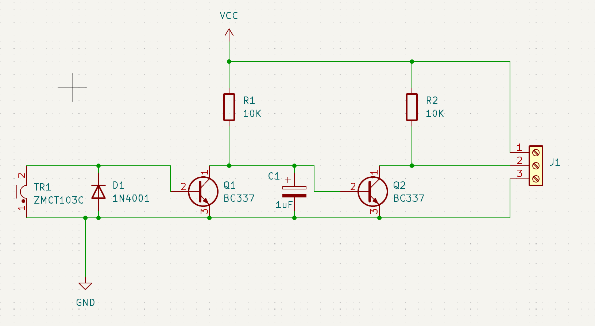

# DCC Block Detector
Simple DCC Block Detector

Using the schematic from https://sites.google.com/site/gregthrottles/pulse-trans
which is based from someone called "Rob Paisley" and extended by myself to add
a second transistor and pull-up resistors. Fed of ~5 Volts you get approx 4.5v 
on the signal line.

# Schematic

# Render
